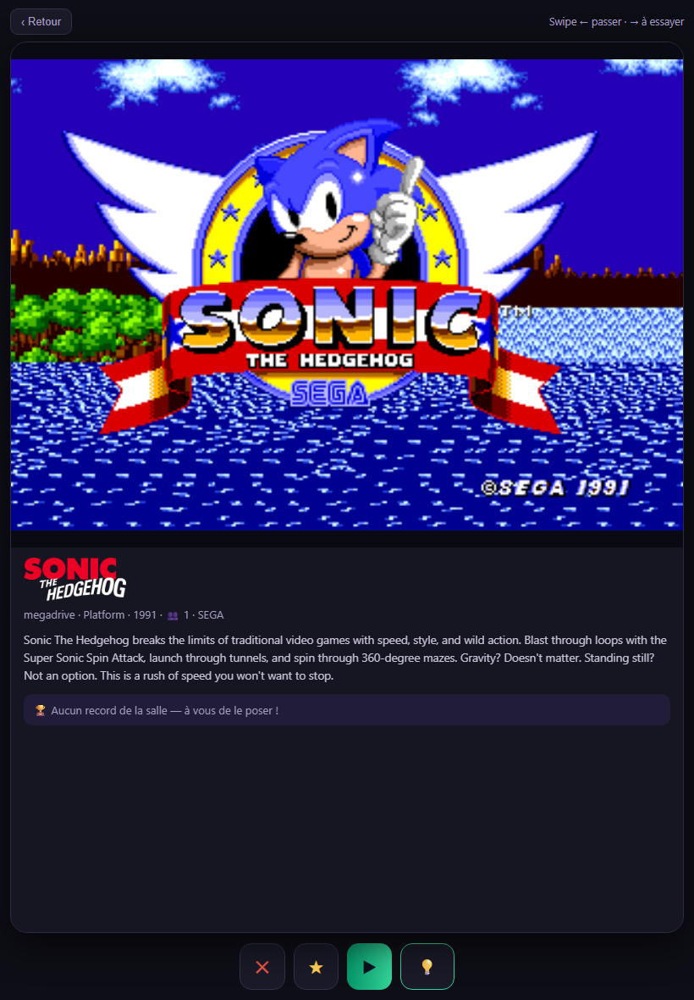
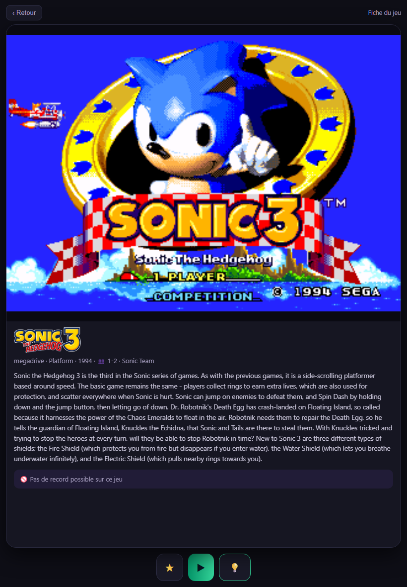

# Player in a venue

You are in a venue equipped with the Fleet Hub. Your identity is **anonymous**: an identifier, a nickname and a recovery code — no personal data, neither on the cabinet nor on the badge.

## Create your badge (once)

At the desk or on the venue's players page, pick a nickname. You get:

- a **QR badge** (printable or kept on your phone);
- a **recovery code** — keep it safe: it is also your claim code to later attach your scores to an [online account](joueur-en-ligne.md).

## Check in on a cabinet

Every cabinet shows a **QR and its number** at the bottom-right of its screen (or on a sticker):

1. **Scan the cabinet's QR** with your phone — or open the venue's check-in page and type the cabinet number.
2. Enter your player code.
3. A "Welcome!" message appears on the cabinet: your scores now count for you, and the cabinet's QR disappears for the length of your session.

## Pick a game from your phone

Once checked in on a cabinet and connected to the **venue's wifi**, your phone becomes a game picker: browse the cabinet's catalogue, read a game's sheet and launch it remotely — the cabinet follows.

### Match your game

Tap **"💡 Match your game"**: you browse the cabinet's whole current system, one card at a time (box art or video, description, the venue record). **The cabinet scrolls along with you** — what you see on the phone is on the screen.

- Swipe **right** (or 💡) to add the game to your **"To try"** list;
- Swipe **left** (or ✕) to move to the next one;
- **▶** launches the game on the cabinet.

### A game's sheet

Tap any game in your lists to open its **sheet**: screenshot (or video), description, **the venue record on that game**, and the **▶ Launch** button. The sheet comes from the cabinet — if the game is in Japanese, your browser app can translate it.

A **blue ⚠ dot** in a game's corner means "no record possible": the score isn't capturable on that title. You're warned **before** launching, not frustrated after.

### Your three lists

- **Recent** — the games you've played, derived from your sessions;
- **★ Favorites** — the ones you starred;
- **💡 To try** — the ones you spotted while browsing ("good idea!").

On a cabinet, every game in these lists **relaunches with one tap** — launching a game closes the one running on the cabinet. The running game shows **⏹ Stop**.

## Leaving

The same gesture signs you out: re-scan, or tap "I'm leaving — sign out" on your phone. A "See you soon!" message confirms — your scores are saved and the cabinet is free again.

## Finding your records

The venue's profile page (recovery code or badge) lists your best scores per game, visit after visit. If the venue takes part in the online rankings, your marks appear there with the "verified venue" provenance.

## Challenges and tournaments

When the venue opens a challenge, the cabinets **announce it full screen**: the game, the objective in big letters ("Most goals in 5 minutes!"), the entry conditions and a **giant QR** — scan it, the cabinet is yours.

1. The game launches by itself when the countdown hits zero.
2. **Press START**: your run freezes on the starting line ("Don't touch anything!").
3. When everyone is ready, **5-4-3-2-1 inside the game** — simultaneous start for all.
4. At the end, the cabinet shows your **rank and the winner**, and the game's top 10 is one tap away on your phone.

Your **player card follows everything live** on your phone: the objective, the countdown, the time remaining. Add it to your home screen and enable **notifications** — you'll know when a contest opens, when a tournament is coming, and when someone **beats your record** ("come take it back!").

Good to know: a challenge played without a real opponent (fewer than 2 players who pressed START) is **not counted** — trophies are earned. In an **open session**, players take turns on the reserved cabinets — every badged run counts for its player.

## Broadcasting your game on your channel

Save your **Twitch stream key** in the app (Me page → "My Twitch channel"): it is stored encrypted and never shown again. During a venue session, the "Playing" screen on your phone then offers:

- **🔴 Broadcast my game** — your gameplay goes live on your channel, automatically branded (your name, the game, the venue, the running event);
- **📡 Rebroadcast the venue feed** — the venue mix (games, leaderboards, atmosphere) goes to your channel while you play;
- **■ Stop my broadcast** — cuts everything; broadcasting also stops by itself when you leave the cabinet.

What about your games on the **venue screens**? Only if you allowed it: the "My games may appear on the venue screens" checkbox (Me page) is your rule — unchecked, your cabinet never shows up on the screens or in the venue stream.

## Badges and trophies

- Next to your nickname on the boards: your **most prestigious reward** (👑 world crown, 🏆 national cup, 🏅 city medal, ⭐ venue star).
- In your profile: your **game badges** — 🎯 Regular (10 runs of the same game), 🔥 Hooked (25), 💎 Legend (50), with the game's pixel icon — and your **tournament win streaks** (🏵️ 3 in a row, 🥇 5, ⚡ 10).
- The more you play and win, the more **colors your pixel avatar earns**.
