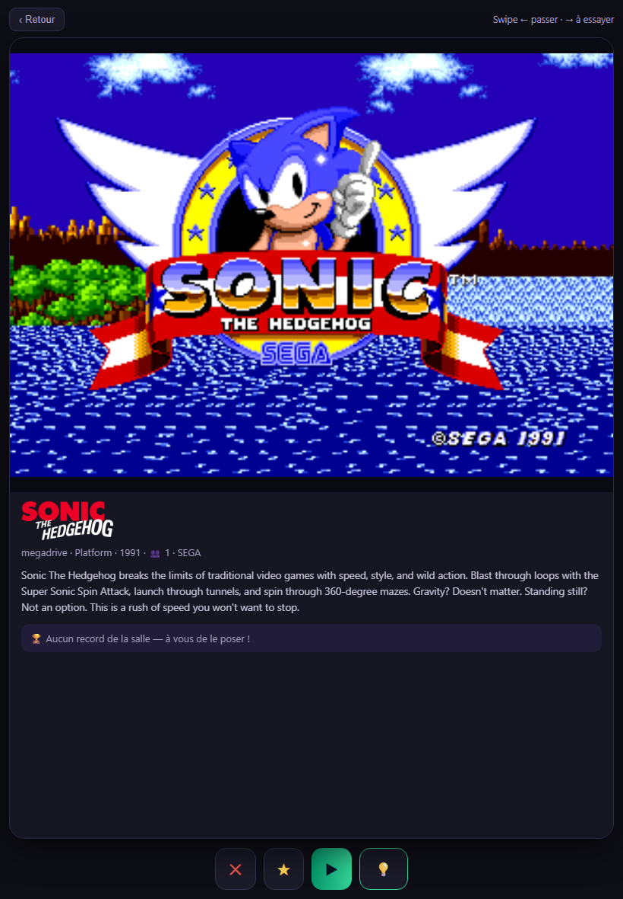
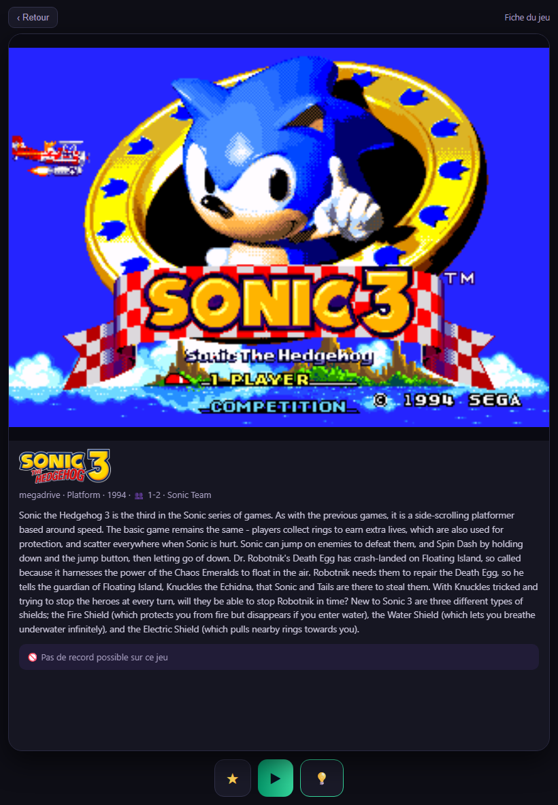

# Joueur en salle

Vous êtes dans une salle équipée du Fleet Hub. Votre téléphone vous identifie sur les bornes, et vos scores vous suivent d'une visite à l'autre. Rien à installer, rien à retenir : aucune donnée personnelle n'apparaît sur la borne ni dans les classements, et votre email ne sert qu'à vous reconnaître.

## S'identifier sur une borne

Chaque borne affiche un **QR** en bas à droite de son écran (ou sur un sticker).

1. **Scannez le QR de la borne** avec votre téléphone.
2. **Première fois ?** Entrez votre email : un lien de connexion arrive. Ouvrez-le depuis ce téléphone, vous revenez ici tout seul. C'est la seule fois où vous tapez quelque chose - il n'y a ni mot de passe, ni code à retenir.
3. Touchez **« 🎮 Me connecter à cette borne »**.
4. Un message « Bienvenue ! » s'affiche sur la borne : vos scores comptent pour vous, et le QR disparaît le temps de votre session.

Les visites suivantes se résument aux étapes 1 et 3 : votre téléphone vous reconnaît, il ne reste qu'à confirmer la borne.

!!! note "Sans email"
    Une salle peut aussi remettre un **badge anonyme** à qui ne souhaite pas donner d'email. Elle vous donne alors un code : il rattache ces scores à un [compte en ligne](joueur-en-ligne.md) le jour où vous en ouvrez un.

## Choisir un jeu depuis votre téléphone

Une fois identifié sur une borne et connecté au **wifi de la salle**, votre téléphone devient une manette de choix : parcourez le catalogue de la borne, consultez la fiche d'un jeu et lancez-le à distance - la borne suit.

### Match ton jeu

Touchez **« 💡 Match ton jeu »** : vous parcourez tout le système en cours de la borne, une carte à la fois (jaquette ou vidéo, description, record de la salle). **La borne défile en même temps que vous** - ce que vous voyez sur le téléphone est à l'écran.

- Balayez à **droite** (ou 💡) pour ajouter le jeu à votre liste **« À essayer »** ;
- Balayez à **gauche** (ou ✕) pour passer au suivant ;
- **▶** lance le jeu sur la borne.

### La fiche d'un jeu

Touchez n'importe quel jeu de vos listes pour ouvrir sa **fiche** : capture d'écran (ou vidéo), description, **record de la salle sur ce jeu**, et le bouton **▶ Lancer**. La fiche vient de la borne - si le jeu est en japonais, l'app de votre navigateur peut le traduire.

Un **rond bleu ⚠** au coin d'un jeu signale « pas de record possible » : le score n'est pas capturable sur ce titre. Vous êtes prévenu **avant** de lancer, pas frustré après.

### Vos trois listes

- **Récents** - les jeux que vous avez joués, déduits de vos parties ;
- **★ Favoris** - ceux que vous avez étoilés ;
- **💡 À essayer** - ceux repérés en parcourant (« bonne idée ! »).

Sur une borne, chaque jeu de ces listes se **relance d'un tap** - lancer un jeu ferme celui en cours sur la borne. Le jeu en cours affiche **⏹ Arrêter**.

## Partir

Le même geste vous déconnecte : re-scannez, ou touchez « Je pars - me déconnecter » sur votre téléphone. Un message « À bientôt ! » confirme - vos scores sont enregistrés et la borne redevient libre.

## Retrouver ses records

Votre carte joueur, sur votre téléphone, liste vos meilleurs scores par jeu, d'une visite à l'autre et d'une salle à l'autre : c'est le même compte partout, vous n'avez rien à rattacher. Si la salle participe aux classements en ligne, vos marques y apparaissent avec la provenance « salle vérifiée ».

## Challenges et tournois

Quand la salle lance un challenge, les bornes l'**annoncent en plein écran** : le jeu, l'objectif en gros (« Le plus de buts en 5 minutes ! »), les conditions d'accès et un **QR géant** - scannez-le, la borne est à vous.

1. Le jeu se lance tout seul à la fin du compte à rebours.
2. **Appuyez sur START** : votre partie se fige sur la ligne de départ (« Ne touchez plus à rien ! »).
3. Quand tout le monde est prêt, **5-4-3-2-1 dans le jeu** - départ simultané pour tous.
4. À la fin, la borne affiche votre **rang et le vainqueur**, et le top 10 du jeu est à un tap sur votre téléphone.

Votre **carte joueur suit tout en direct** sur votre téléphone : l'objectif, le décompte, le temps restant. Ajoutez-la à votre écran d'accueil et activez les **notifications** - vous saurez quand un contest s'ouvre, quand un tournoi se prépare, et quand quelqu'un **bat votre record** (« reviens le reprendre ! »).

Bon à savoir : un challenge joué sans véritable adversaire (moins de 2 joueurs ayant appuyé sur START) n'est **pas comptabilisé** - les trophées se méritent. En **session libre**, les joueurs se relaient sur les bornes réservées - chaque passage badgé compte pour son joueur.

## Diffuser sa partie sur sa chaîne

Enregistrez votre **clé de stream Twitch** dans l'app (page Moi → « Ma chaîne Twitch ») : elle est conservée chiffrée et jamais réaffichée. Pendant une session en salle, l'écran « En jeu » de votre téléphone propose alors :

- **🔴 Diffuser ma partie** - votre écran de jeu part en direct sur votre chaîne, habillé automatiquement (votre pseudo, le jeu, la salle, l'événement en cours) ;
- **📡 Rediffuser le flux de la salle** - la régie de la salle (parties, classements, ambiance) part sur votre chaîne pendant que vous jouez ;
- **■ Arrêter ma diffusion** - coupe tout ; la diffusion s'arrête aussi toute seule quand vous quittez la borne.

Et vos parties sur les **écrans de la salle** ? Uniquement si vous l'avez autorisé : la case « Mes parties peuvent passer sur les écrans de la salle » (page Moi) est votre règle - décochée, votre borne n'apparaît jamais sur les écrans ni dans le stream de la salle.

## Badges et trophées

- À côté de votre pseudo sur les classements : votre **récompense la plus prestigieuse** (👑 couronne mondiale, 🏆 coupe nationale, 🏅 médaille de ville, ⭐ étoile de salle).
- Dans votre fiche : vos **badges de jeu** - 🎯 Habitué (10 parties d'un même jeu), 🔥 Accro (25), 💎 Légende (50), avec l'icône pixel du jeu - et vos **séries de victoires** en tournoi (🏵️ 3 d'affilée, 🥇 5, ⚡ 10).
- Plus vous jouez et gagnez, plus votre **avatar pixel gagne de couleurs**.
