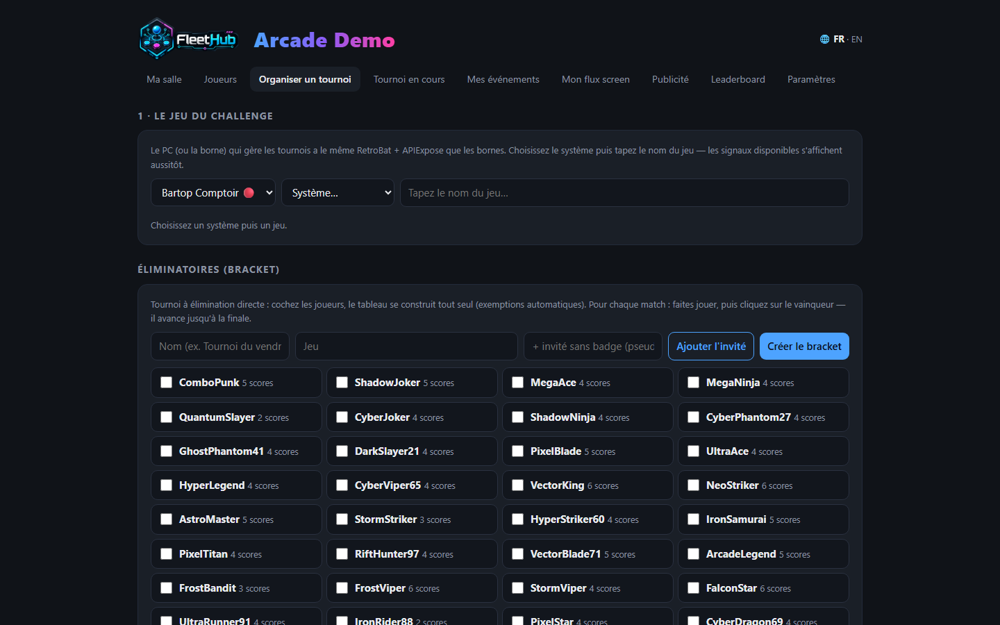
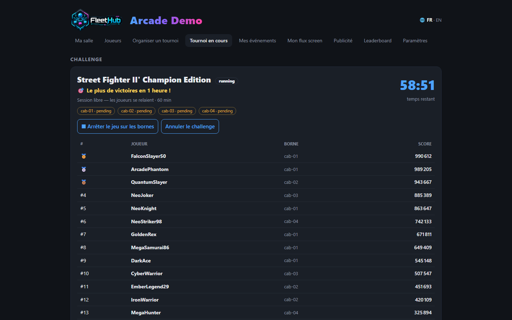

# Tournament organizer

From the hub console, two tabs do everything: **Organize a tournament** (prepare the challenge) and **Live tournament** (open it, start it, follow it). One golden rule: test everything **before** the event.

## A challenge, start to finish, in 60 seconds

1. **Organize**: reference cabinet → **system → game** (RetroAchievements-compatible versions are flagged 🏆 and prioritized; your 5 most recent games relaunch in one click). The game's **signals are checked automatically** on selection.
2. Write the **objective in plain words** ("Most goals in 5 minutes!") — that's what players will see in big letters on the cabinets — and pick the **challenge type**.
3. **Open the challenge** (Live tournament tab): every free cabinet shows the **full-screen announce** — game fanart, objective, entry conditions, countdown, giant QR. Players scan to claim their cabinet. At zero, **the game launches by itself**.
4. Each player **presses START**: their run freezes on the starting line and their nickname turns **👍 Ready** in your console.
5. **Start the challenge**: a **5-4-3-2-1 countdown inside the game** on every cabinet, simultaneous start to the second.
6. At the end: every cabinet shows the **result and the player's rank**, the game closes cleanly, the podium is archived — one click away in the history.

## The four challenge types

| Type | Objective | Ranking |
|---|---|---|
| ⏱ **Timer** | Highest score within the time limit | Score |
| 🏁 **Race** | First to N × a signal ("15 rings") | Shortest time |
| ⚡ **Time attack** | First to ONE signal (level cleared, boss beaten) | Shortest time |
| 💀 **Survival** | The chosen signal = game over | **Longest** time |

Everything is measured **inside the game's memory** (`.MEM` signals) — no manual scorekeeping, no cheating possible.

## Entry conditions and fairness

- **Reserve a challenge for the regulars**: "5+ scores in the venue", "2+ round entries" — checked at QR scan, refusal explained to the player, conditions **announced under the objective** on the cabinets.
- **Automatic fairness**: a challenge played with fewer than **2 real participants** (START pressed) is **never counted** — no records, no trophies. Your cups keep their value.

## ✅ Test before the event (essential)

1. **Signals check themselves** when you select the game (live score / records / usable signal count). No signals: no "live score" — only "records" remains possible.
2. **Test round**: tick "Test" at creation — full workflow (announce, START, countdown, timer, podium) but **nothing is recorded or published**.
3. **Replay the players' gestures**: QR scan, START, start — the exact day-of journey.

## Open session (relay play)

For a 1-to-4-hour slot on N reserved cabinets: pick a duration of 1 h or more — players **take turns** (the current badge rules: every mark counts for its player), the **per-player ranking** feeds live, and the podium **stays on screen** until you route the display elsewhere.

## Brackets (knockout)

In Organize: tick the players (walk-in guests without a badge welcome), the **bracket builds itself** (automatic byes). Play each match — one challenge per match if you like — then **click the winner**: they advance to the final and the champion is crowned.

## Screens, phones and one-off events

- Every venue screen is driven from the console ([venue manager guide](gestionnaire.md)); the **full-screen leaderboard** shows the game's logo and live scores.
- Players follow the challenge **on their phone**: objective, countdown, time remaining, final top 10 — and notifications bring them back ("your record was just beaten").
- For a tournament weekend in a venue without a yearly license, the **Event pass** (30 days, all cabinets) is made for that — [nelfetech.com/salles](https://nelfetech.com/salles.html).
- On stream, Retro Creator's Studio edition adds Live Contest, scoreboard and podium overlays ([streamer guide](streamer.md)).
